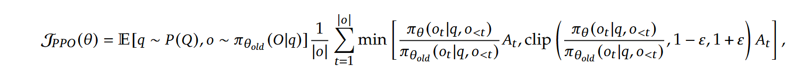
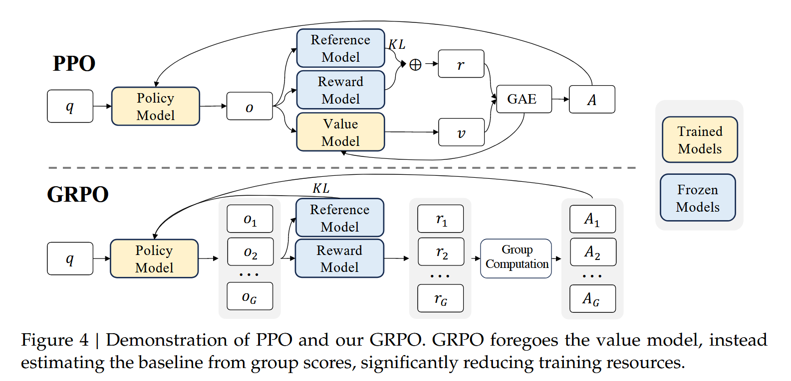
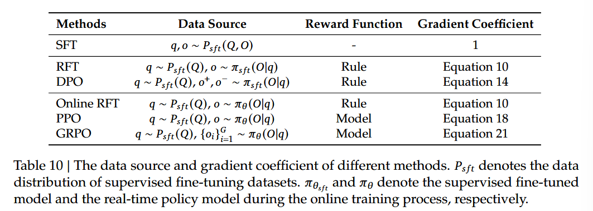

# DeepSeekMath: Pushing the Limits of Mathematical Reasoning in Open Language Models

* Goal: mathematical reasoning
* Key contribution: (1) meticulous engineered data selection pipeline (2) GRPO
* Benchmarks: MMLU, BBH, GSM8K, MATH, CMATH

## Method

(1) DeepSeek-Math Corpus, a large scale high quality pre-training corpus of 120B math tokens. Extraced from Common Crawl (CC) using a fastText-based classifier. Trained using OpenWebMath as positive examples. Then mine from CC and refined with human annotation.

(2) DeepSeekMath-Base is initialized with DeepSeek-Coder-Base-v1.5 7B, noticed from code training model is better choice compared to a general LLM. Math training also improve model capability on MMLU and BBH benchmarks.

(3) Apply mathematical tuning to DeepSeekMath-Nase with chain-of-thought, program-of-thought, and tool-integrated reasoning. Resulting model DeepSeekMath-Instruct 7B.

> Z. Gou, Z. Shao, Y. Gong, Y. Shen, Y. Yang, M. Huang, N. Duan, and W. Chen. Tora: A toolintegrated reasoning agent for mathematical problem solving. CoRR, abs/2309.17452, 2023. doi: 10.48550/ARXIV.2309.17452. URL https://doi.org/10.48550/arXiv.2309.1745

(4) Group Relative Policy Optimization (GRPO), a variant Reinforcement Learning algorithm of Proximal Policy Optimization (PPO). GRPO estimate the baseline from group scores, significantly reducing training resources.

## 3 Supervised Fine Tuning

1. SFT Data Curation
   1. English mathematical database: GSM8K, MATH, Lila-OOD
   2. Chinese mathematical database: Chinese K-12

## 4 Reinforcement Learning

Reinforcement learning has been proven effective in further improving mathematical reasoning ability after Supervised-Fine-Tuning (SFT) stage.

### From PPO to GRPO

PPO is an actor-critic RL algorithm that is widely used. It optimizes LLM by maximizing the following surrogate objective:



where $\pi_{\theta}$ and $\pi_{\theta_{old}}$ are the current and old policy models, and $q, o$ are questions and outputs sampled from question dataset and old policy $\pi_{\theta_{old}}$, respectively. $\epsilon$ is a clipping-related hyper-parameter introduced in PPO for stabilizing training. $A_t$ is the advantage, computed by applying Generalized Advantage Estimation (GAE) based on the reward ${r_{\geq t}}$ and a learned value function $V_\psi$. In PPO, a value function needs to be trained alongside the policy model and to mitigate over-optimization of the reward-model.



For each question q, GRPO samples a ground of outputs ${o_1, o_2, ..., o_G}$ from old policy $\pi_{\theta_{old}}$ and thenoptimize the policy model by maximizing the following objective:

$$
\mathcal{J}_{\text{GRPO}}(\theta) = \mathbb{E}_{q \sim P(Q),\, \{o_i\}_{i=1}^G \sim \pi_{\theta_{\text{old}}}(O|q)} \\
\left[ \frac{1}{G} \sum_{i=1}^G \frac{1}{|o_i|}\sum_{t=1}^{|o_i|}\left\{\min\!\left(\frac{\pi_\theta(o_{i,t}\mid q, o_{i,<t})}{\pi_{\theta_{\text{old}}}(o_{i,t}\mid q, o_{i,<t})}\hat{A}_{i,t},\,\text{clip}\!\left(\frac{\pi_\theta(o_{i,t}\mid q, o_{i,<t})}{\pi_{\theta_{\text{old}}}(o_{i,t}\mid q, o_{i,<t})},1-\epsilon, 1+\epsilon\right)\hat{A}_{i,t}\right)- \beta\, \mathcal{D}_{\text{KL}}\!\big[\pi_\theta \,\|\, \pi_{\text{ref}}\big]\right\}\right]

$$

where $\epsilon$ and $\beta$ are hyperparameters, and $\hat{A}_{i,t}$ is advantage calculated based on relative rewards of the outputs inside each group only.

### Algorithm 1 Iterative Group Relative Policy Optimization

**Input:**  
Initial policy model $\pi_{\theta_{\text{init}}}$;  
Reward model $r_\varphi$;  
Task prompts $\mathcal{D}$;  
Hyperparameters $\varepsilon, \beta, \mu$

``` makefile
**Procedure:**
1:  policy model πθ ← πθ_init  
2:  for iteration = 1, …, I do  
3:      reference model π_ref ← πθ  
4:      for step = 1, …, M do  
5:          Sample a batch 𝒟_b from 𝒟  
6:          Update the old policy model πθ_old ← πθ  
7:          Sample G outputs { o_i }₁ᴳ ∼ πθ_old(· | q) for each q ∈ 𝒟_b  
8:          Compute rewards { r_i }₁ᴳ for each sampled o_i by running r_φ  
9:          Compute Â_{i,t} for the t-th token of each group output through group relative advantage estimation  
10:          for GRPO iteration = 1, …, μ do
11:              Update the policy model πθ by maximizing the GRPO objective (Equation 21)
12:          end for
13:     Update r_φ through continuous training using a replay mechanism
14:     end for
15: end for

**Output:** πθ
```

Difference from the KL penalty term in PPO is we estimate the KL divergence with the following unbiased estimator (Schulman, 2020) guaranteed to be positive: 

$$
\mathbb{D}_{KL}|\pi_{\theta}||\pi_{ref}| = \frac{\pi_{ref}(o_{i,t}\mid q, o_{i,<t})}{\pi_\theta(o_{i,t}\mid q, o_{i,<t})} - \log{\frac{\pi_{ref}(o_{i,t}\mid q, o_{i,<t})}{\pi_\theta(o_{i,t}\mid q, o_{i,<t})}} - 1
$$

> J. Schulman. Approximating kl divergence, 2020. URL http://joschu.net/blog/kl-app rox.html.

#### 4.1.2 Outcome Supervision RL with GRPO

Formally for each question q, a group of outputs {o1, o2, ..., oG} are sampled from old policy model $\pi_{\theta_{old}}$. A reward model is then used to score the ouputs, yielding $G$ rewards $\mathbf{r}={r_1, r_2, ..., r_G}$ corresponding. Then rewards normalized by substracting the ground average and divide by group standard deviation. Outcome supervision provides the normalized reward at the end of each output $o_i$ and sets the advantages $\hat{A}_{i,t}$ of all tokens in the output as the normalized reward, i.e., $\hat{A_{i,t}}=\tilde{r_i}=\frac{r_i - mean(r)}{std(r)}$, and then optimize the policy by maximizing the objective. 

#### 4.1.3 Process Supervision RL with GRPO 

Outcome supervision only provides a reward at the end of each output, which may not be sufficient and efficient to supervise the policy in math tasks. 

> P. Wang, L. Li, Z. Shao, R. Xu, D. Dai, Y. Li, D. Chen, Y. Wu, and Z. Sui. Math-shepherd: Verify and reinforce llms step-by-step without human annotations. CoRR, abs/2312.08935, 2023b.

Process supervision provides a reward at the end of each reasoning step. Given the question q and G sampled outputs {o1, o2, ..., oG}, a process reward model is used to score each step of the outputs, yielding corresponding rewards: $\mathbf{R} = \{\{r^{index(1)}_1, ..., r^{index(K_1)}_1\}, ..., \{r^{index(1)}_G, ..., r^{index(K_G)}_G\}\}$, where $index(j)$ is the end token index of the j-th step, and $K_i$ is the total number of steps in the i-th output. 

Also normalize rewards with average and standard deviation, i.e., $\tilde{r_{i}^{index(j)}=\frac{r_i^{index(j)} - \text{mean}(\mathbf{R})}{std(\mathbf{R})}}$. Subsequently, the process supervision calculates the advantage of each token as the sum of the normalized rewards, i.e., $\tilde{A}_{i,t}=\sum_{index(j) \geq t}{\tilde{r}_i^{index(j)}}$. Then optimize the policy by maximizing the objective. 

#### 4.1.4 Iterative RL with GRPO

As reinforcement learning training process progresses, the old reward model may not be sufficient to supervise the current policy model. In iterative GRPO, we generate new training sets for the reward model based on sampling results from the policy model and continually train the old reward model using a replay mechanism that incorporates 10% of historical data. Then set the reference model as the policy model, and continually train the policy model with new reward model. 

### 4.2 Training and Evaluating DeepSeekMath-RL

* 144k questions from GSM8K and MATH from SFT data
* training set of reward model following (Wang et al., 2023b). 
* Initial reward model trained with learning rate of 2e-5, GRPO policy model learning rate 1e-6. KL coefficient 0.04. Sample 64 outputs for each question, maximum length 1024, training batch size 1024.
* Policy model single update after exploration. 

## 5 Discussion 

* code training improve reasoning
* studied two stage training and one stage training 
* Arxiv paper seems ineffective in improving mathematical reasoning
* Unified paradigm to analyze training methods
 


where SFT is supervised fine-tuning, RFT is rejection sampling fine-tuning, DPO is direct preference optimization. 

Online sampling: training data is from the exploration results of the real-time training policy model. E.g. RFT and DPO. 
Offline sampling: training data is from sampling results of the initial SFT model, e.g. Online RFT and GRPO. 

* GRPO adjusts gradient coefficient based on the reward value provided by reward model  
* DeepSeekMath evaluated the Pass@K and Majj@K accuracy for instruct and RL model. RL improvement is attributed to boosting the correct response from TopK rather than the enhancement of fundamental capabilities.

> 文中经常提到 (Wang et al., 2023a)，需要读一下

* more effective RL: data source, algorithm, reward function
  * data source: we think potential reason our RL pipeline only improve Maj@k because only use questions from instruction tuning stage and a native nucleus sampling to sample outputs
  * Algorithm: be more robt gainst noisy reward signals
  * Reward function: enhance generalization ability of reward model, uncertainty , and high quality process reward model  