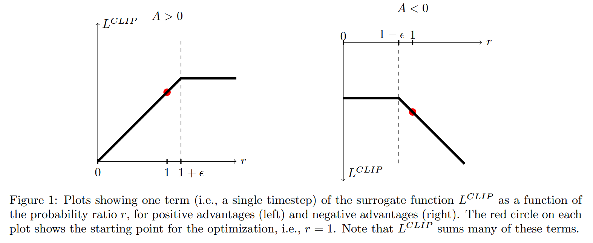

# Proximal Policy Optimization Algorithms

Alternate between sampling data through interaction with the environment and optimize a 'surrogate' objective function using stochastic gradient ascent.

Leading reinforcement learning methods with nueral netork function approximations:

* deep Q-learning [V. Mnih, K. Kavukcuoglu, D. Silver, A. A. Rusu, J. Veness, M. G. Bellemare, A. Graves, M. Riedmiller, A. K. Fidjeland, G. Ostrovski, et al. “Human-level control through deep reinforcement learning”. In: Nature 518.7540 (2015), pp. 529–533.]
  * fails on many simple problem and  is poorly understood
* "vanilla" policy gradient method [V. Mnih, A. P. Badia, M. Mirza, A. Graves, T. P. Lillicrap, T. Harley, D. Silver, and K. Kavukcuoglu. “Asynchronous methods for deep reinforcement learning”. In: arXiv preprint arXiv:1602.01783 (2016).]
  * poor data effciency and robustness
* trust region / natural policy gradient methods. [J. Schulman, S. Levine, P. Moritz, M. I. Jordan, and P. Abbeel. “Trust region policy optimization”. In: CoRR, abs/1502.05477 (2015).]
  * relatively complicated, not compatible with architecture that include noise (such as dropout) or parameter sharing between policy and value function, or with auxiliary tasks

## Background

### 1 Policy Gradient Method

Policy gradient method: compute estimator of policy gradient and then stochastic gradient ascent. Common gradient estimator:

$$
\hat{g} = \hat{\mathbb{E}}_t \left[ \nabla_{\theta} \log \pi_{\theta}(a_t \mid s_t) \hat{A}_t \right]

$$


| Symbol                                            | Meaning                                                | Intuition                                                                                                                                                                                                                                                     |
| :-------------------------------------------------- | :------------------------------------------------------- | :-------------------------------------------------------------------------------------------------------------------------------------------------------------------------------------------------------------------------------------------------------------- |
| $\hat{g}$                                         | **Estimated policy gradient**                          | The average gradient used to update the policy parameters. It’s what we compute to perform a gradient ascent step in policy optimization.                                                                                                                    |
| $\hat{\mathbb{E}}_t[\cdot]$                       | **Empirical expectation over time steps (or samples)** | The expectation is usually approximated by sampling trajectories from the policy. The hat ( (\hat{}) ) indicates it’s a*sample-based estimate* rather than the true expectation.                                                                             |
| $\nabla_{\theta} \log \pi_{\theta}(a_t \mid s_t)$ | **Score function (policy gradient term)**              | Measures how changing the parameters ( \theta ) would increase or decrease the log-probability of taking action ( a_t ) in state ( s_t ). This is the “direction” in parameter space that increases the likelihood of actions that led to good outcomes.    |
| $\pi_{\theta}(a_t \mid s_t)$                      | **Stochastic policy**                                  | The probability distribution (parameterized by ( \theta )) over possible actions given the state ( s_t ). For example, a Gaussian in continuous control, or a softmax over discrete actions.                                                                  |
| $a_t, s_t$                                        | **Action and state at time ( t )**                     | The agent’s interaction with the environment — ( a_t ) is sampled from ( \pi_\theta(\cdot \mid s_t) ).                                                                                                                                                      |
| $\hat{A}_t $                                      | **Estimated advantage function**                       | Measures how much better an action ( a_t ) was compared to the expected value of the state ( s_t ). It “centers” the returns so that actions better than expected get positive weight and worse ones get negative weight. Commonly estimated as:  A = R - V |

When using automatic differentiaion software (e.g. PyTorch), usually construct a objective function that its differential is the estimator $\hat{g}$, so estimator can be calculated by differentiate:

$$
L^{PG}(\theta) = \hat{\mathbb{E_t}} [ \log \pi_\theta(a_t | s_t) \hat{A}_t ]

$$


| 阶段                         | 做什么                                | 对应概念               |
| :----------------------------- | :-------------------------------------- | :----------------------- |
| ①**Rollout**                | 用当前策略与环境交互，收集 (s, a, r)  | 采样数据               |
| ②**Compute Advantage**      | 从奖励计算 (\hat{A}_t)                | 衡量行动好坏           |
| ③**Policy Gradient Update** | 用 (\nabla_\theta \log \pi_\theta(a_t | s_t)\hat{A}_t) 更新 θ |
| ④**Repeat**                 | 新策略再去环境采样新的 rollouts       | 下一轮迭代             |

### 2 Trust Region method

An objective function ("surrogate" objective) is maximized subject to a constraint on the size of the policy update.

$$
\text{maximize}_{\theta} \; \hat{\mathbb{E}}_t 
\left[ \frac{\pi_{\theta}(a_t \mid s_t)}{\pi_{\theta_{\text{old}}}(a_t \mid s_t)} \hat{A}_t \right]
\\
\text{subject to } \hat{\mathbb{E}}_t
\left[ \mathrm{KL}\!\left[\pi_{\theta_{\text{old}}}(\cdot \mid s_t), \pi_{\theta}(\cdot \mid s_t)\right] \right] \le \delta

$$

here $\theta_{old}$ is the vector of policy parameter before the update. Can be efficiently solved using conjugate gradient algorithm, with a linear approximation to objective and quadratic approximation to constraint.

> 基本上就是对 policy gradient 做了 first order approximation, 然后为了防止 update 太大加了个每次 update 的 step 大小限制.

Essentially solving the unconstrained optimization problem for some coefficient $\beta$:

$$
\text{maximize}_{\theta} \; \hat{\mathbb{E}}_t \left[ \frac{\pi_{\theta}(a_t \mid s_t)}{\pi_{\theta_{\text{old}}}(a_t \mid s_t)} 
\hat{A}_t - \beta \mathrm{KL}\!\left[\pi_{\theta_{\text{old}}}(\cdot \mid s_t), \pi_{\theta}(\cdot \mid s_t)\right] \right]

$$

## 3 PPO - Clipped Surrogate Objective

Let $r_t(\theta)$ denote the probability ratio $r_t(\theta) = \frac{\pi_{\theta}(a_t \mid s_t)}{\pi_{\theta_{\text{old}}}(a_t \mid s_t)}$, so $r(\theta_{\text{old}}) = 1$.

TRPO maximizes a "surrogate" objective:

$$
L^{CPI}(\theta) = \hat{\mathbb{E}}_t
\left[ \frac{\pi_{\theta}(a_t \mid s_t)}{\pi_{\theta_{\text{old}}}(a_t \mid s_t)} \hat{A}_t \right]
= \hat{\mathbb{E}}_t \left[ r_t(\theta)\hat{A}_t \right].

$$

where CPI refer to Conservative Policy Iteration. Withou constraint, maximization lead to an excessively large policy update. So add a factor to importance sampling.

The main objective we propose:

$$
L^{CLIP}(\theta) = \hat{\mathbb{E}}_t \left[ \min\!\left( r_t(\theta)\hat{A}_t,\; \mathrm{clip}\!\left(r_t(\theta), 1-\epsilon, 1+\epsilon\right)\hat{A}_t \right)\right]

$$

where $\epsilon$ is a hyperparameter (e.g. $\epsilon=0.2$). Second clip term modifies the surrogate objective by clipping the probability ratio, remove the incentive for moving $r_t$ outside of the interval $[1-\epsilon, 1+\epsilon]$. The minimum take whichever is lower from clipped or unclipped objective, only ignore change in probability ratio when it would make objective improve, include it when make objective worse. Therefore $L^{CLIP}(\theta) \approx L^{CPI}(\theta)$ when $r\approx 1$. Figure below plot show probability ratio r is clipped depends on advantage A is positive or negative.



## 4 PPO - Adaptive KL Penalty Coefficient

Another approach as alternative to clipped surrogate objective by using a penalty on KL divergence so we achieve some target value of KL divergence $d_{targ}$ each policy update. This perform worse then clipped method, include for reference / as baseline.

Using several epochs of minibatch SGD, optimize the KL-penalized objective:

$$
L^{KLPEN}(\theta)
= \hat{\mathbb{E}}_t \left[ \frac{\pi_{\theta}(a_t \mid s_t)}{\pi_{\theta_{\text{old}}}(a_t \mid s_t)} \hat{A}_t - \beta \mathrm{KL}\!\left[\pi_{\theta_{\text{old}}}(\cdot \mid s_t), \pi_{\theta}(\cdot \mid s_t)\right] \right]

$$

Compute $d = \hat{\mathbb{E}}_t \left[ \mathrm{KL}\!\left[\pi_{\theta_{\text{old}}}(\cdot \mid s_t), \pi_{\theta}(\cdot \mid s_t)\right] \right] $


| 条件                               | 含义                       | 操作                          |
| :----------------------------------- | :--------------------------- | :------------------------------ |
| $ d < d_{\text{targ}} / 1.5 $      | 更新太小（策略变化太保守） | β 减半，放宽惩罚，让步子更大 |
| $ d > d_{\text{targ}} \times 1.5 $ | 更新太大（策略变化太猛）   | β 翻倍，收紧惩罚，让步子更小 |

In experiment, occasionally see policy update where KL divergence is significantly different, however rare. Parameters are chosen 1.5 and 2 heuristically.

> 这个也太呆了，拍脑袋定的参数。学数学的来看能晕过去...

## 5 Algorithm

In recurrent neural network, we have objective:

$$
L_t^{CLIP+VF+S}(\theta) = \hat{\mathbb{E}}_t \left[ L_t^{CLIP}(\theta) - c_1 L_t^{VF}(\theta) + c_2 S[\pi_{\theta}](s_t) \right]

$$

where $c_1, c_2$ are coefficient, $S$ is entropy bonus, and $L_t^{VF}$ is squared error loss $(V_{\theta}(s_t)-V_t^{targ})^2$, V and VF are both value functions. Can be understood as L = Actor - critic + explortaion

> 这他妈啥符号定义 V = VF?


| 模块              | 名称                                         | 数学式                    | 作用                                                   |
| :------------------ | :--------------------------------------------- | :-------------------------- | :------------------------------------------------------- |
| Policy loss       | $L^{CLIP}$                                   | 限制更新幅度              | 主优化目标                                             |
| Value loss        | $L^{VF}$                                     | $(V_\theta - V^{targ})^2$ | 学 critic 估值                                         |
| Entropy bonus     | $S[\pi_\theta]$                              | $-\sum \pi \log \pi$      | 衡量策略的不确定性，促进探索；奖励 high entropy 的策略 |
| Advantage (RNN)   | $A_t = \sum (\gamma \lambda)^k \delta_{t+k}$ | RNN 中多步依赖            | 降低方差，提高稳定性                                   |
| Parallel sampling | (N) actors × (T) steps                      | batch size (=NT)          | 稳定估计梯度，避免更新频率过低或者过高                 |

```markdown
**Algorithm 1** PPO, Actor-Critic Style

for iteration = 1, 2, ...
  for actor = 1, 2, ..., N do
    Run policy π_old in environment for T timesteps
    Compute advantage estimates Â₁, ..., Â_T
  end for
  Optimize surrogate L wrt θ, with K epochs and minibatch size M ≤ N*T
  θ_old ← θ
end for
```

## References

> J. Schulman, F. Wolski, P. Dhariwal, A. Radford, and O. Klimov. Proximal policy optimization algorithms. arXiv preprint arXiv:1707.06347, 2017.
> J. Schulman. Approximating kl divergence, 2020. URL http://joschu.net/blog/kl-app rox.html.
> J. Schulman, P. Moritz, S. Levine, M. Jordan, and P. Abbeel. High-dimensional continuous control using generalized advantage estimation. arXiv preprint arXiv:1506.02438, 2015.

## Keywords

Scalable: scalable to large models and parallel implementations
data efficient:
robustness: i.e., successful on a variety of problems without hyperparameter tuning
