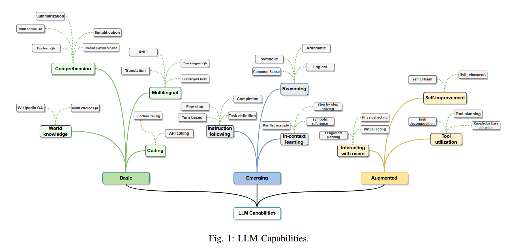

# Chapter 1 History  

Language modelling starts in 1950s with Shannon's application of information theory to human language. Since then, statistical language modeling became fundamental. Recent success of LLMs is an accumulation of decades of research, mainly in four waves: statistical language models, neural language models, pre-trained language models and LLMs.  

Statistical language models (SLMs) view text as a sequence of words, and estimate the probability if text as the product of their word probabilities. Dominating form being **Markov chain model** known as the n-gram models, compute the probability of a word conditioned on its immediate proceeding n-1 words. Since word probabilities are estimated using word and n-gram counts collected from text corpora, the model needs to deal with data sparsity by using **smoothing**, where some probability mass of model is reserved from unseen n-grams. [S. F. Chen and J. Goodman, “An empirical study of smoothing techniques for language modeling,” Computer Speech & Language, vol. 13, no. 4, pp. 359–394, 1999.] 

Neural Language Models (NLMs) deal with data sparsity by mapping words to low dimensional continuous vectors (embedding vectors) and predict the next word based on the aggregation of the embedding vectors of its proceeding words using neural networks. The embedding vectors learned by NLMs defined a hiiden space where the semantic similarity between vectors can be readily computed as their distance. This allows compute semantic similarity of any two inputs regardless of form (query, document, different language, different modalities). Early NLMs are task specific models.  [Y. Bengio, R. Ducharme, and P. Vincent, “A neural probabilistic language model,” Advances in neural information processing systems, vol. 13, 2000]

Pretrained language models (PLMs) are task-agnostic, generality extends to the learned hidden embedding space. It follows the **pre-training and fine tuning** paradigm. Recurrent neural network or transformers language models are trained on Web-scale unlabeled text corpora for general tasks such as word prediction, then fine tuned on task specifc data. [C. Zhou, Q. Li, C. Li, J. Yu, Y. Liu, G. Wang, K. Zhang, C. Ji, Q. Yan, L. He et al., “A comprehensive survey on pretrained foundation models: A history from bert to chatgpt,” arXiv preprint arXiv:2302.09419, 2023.] 

Large language models mainly refer to transformer-based neural language models that contains tens to hundreds of billions of parameters, such as PaLM, LLaMA, GPT-4. New emergent abilities include (1) in-context learning, (2) instruction following (3) multi-step reasoning w/ chain of thought prompt. LLMs can also be augmented by using external knowledge and tools so they can interact with user and environment and continuously improve itself using feedback data collected through interactions (e.g. via Reinforcement learning with human feedback (RLHF)).  

Through techniques, LLMs can be deployed as AI agents, can sense environments, make decisions, and take actions. Now emergent abilities of LLMs allow to build general-purpose AI agents. While LLMs are trained to produce responses in static settings, AI agents need to take actions to interact with dynamic environment. Therefore, LLM-based agents often need to augment LLMs.  

## Large Language Models 

### Early Pre-trained Neural Language Models 

1. Encoder-only PLMs, developed for language understanding tasks such as text classification, e.g. BERT, RoBERTa, ALBERT, DeBERTa. 
2. Decoder-only PLMs: GPT-1 demonstrates the first time good performance over a wide range of language tasks, trained on a diverse corpus of unlabeleed text in a self-supervised learning followed by discriminative fine-tuning on each specific task. GPT-2 shows language model can learn specific natural language task without supervision when trained on a large WebText dataset. 
3. Encoder-Decoder PLMs: Raffle et al. shows that almost all NLP tasks can be cast as sequence-to-sequence generation task. A unified model that can perform all natural language understanding and generation tasks.  [C. Raffel, N. Shazeer, A. Roberts, K. Lee, S. Narang, M. Matena, Y. Zhou, W. Li, and P. J. Liu, “Exploring the limits of transfer learning with a unified text-to-text transformer,” The Journal of Machine Learning Research, vol. 21, no. 1, pp. 5485–5551, 2020.] Representative encoder-decoder PLMs: T5, mT5, MASS, and BART. 
4. 