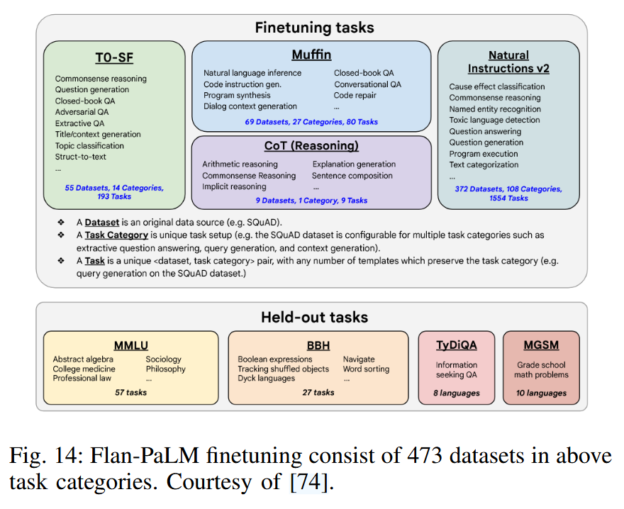

# LLM Families 

## GPT Family

GPT-3: pre-trained autoregressive language model with 175 billion parameters. First general LLM. 
InstrucGPT: proposed to align language models with user intent on a wide range of tasks by fine tuning with human feedback (RLHF). 
ChatGPT: enable user to steer a conversation to complete tasks
GPT-4: multi-modal LLM pre-trained to predict text and finetuned with RLHF
CODEX: a general purpose programming model that can parse natural language and generate code in response.  [arXiv preprint arXiv:2107.03374, 2021.]
WebGPT: GPT-3 fined tuned to answer open-ended questions using a text based web browser. [arXiv:2112.09332, 2021.]

## The LLaMA Family 

LLaMA: released in Feb 2023, ranging from 7B to 65B parameters. Uses GPT-3 transformer architecture with a few modifications. (1) SwiGLU instead of ReLU (2) Rotary positional embeddings instead of absolute positional embedding (3) root-mean-squared layer-normalization instead of standard layer-normalization. [arXiv:2302.13971, 2023.]
LLaMA 2: pretraining + supervised fine-tuning + iterative refined using RLHF, rejection sampling and **proximal policy optimization**. [arXiv:2307.09288, 2023.]
Alpaca: finetuned from LLaMA-7B using 52K instruction following demonstrations using GPT-3.5; very cost effective for academic research, similarly to GPT-3.5
Vicuna: 13B chat model, finetuned LLaMA on user-shared conversation, using **GPT-4 as evaluator**. $300 training cost. 
Guanaco: finetuned LLaMA model using instruction following data using **QLoRA**, so can finetine 65B model onn a single 48GB GPU. QLoRA back propagates using forzen, 4-bit quantized into LoRA. Reaching 99.3% of ChatGPT requiring 24 hours of fine-tuning on a single GPU. 
Koala: yet another instruction-following language model 
Mistral-7B: grouped-query attention for faster inference, sliding window attention to effective handle sequences of arbitrary length 

## The PaLM Family 

PaLM: 540B parameter LLM, trained on 6144 TPU v4 chip (Pathway system), SOTA few-shot learning [arXiv:2204.02311, 2022.]
U-PaLM: 8B, 62B, 540B trained on PaLM with UL2R, 2x computational saving rate [arXiv:2210.11399, 2022.]
Flan-PaLM: finetune on larger tasks, model size and chain-of-thought data. 

PaLM-2: more compute-efficient LLM with better multilingual and reasoning capabilit. 
Med-PaLM: domain specific PaLM, designed to provided high quality answer to medical questions. Finetuned using instruction prompt tuning. 

## Deepseek

## Other Representative LLMs
Gemini: multimodal models via efficient attention mechanism [arXiv:2312.11805, 2023.]