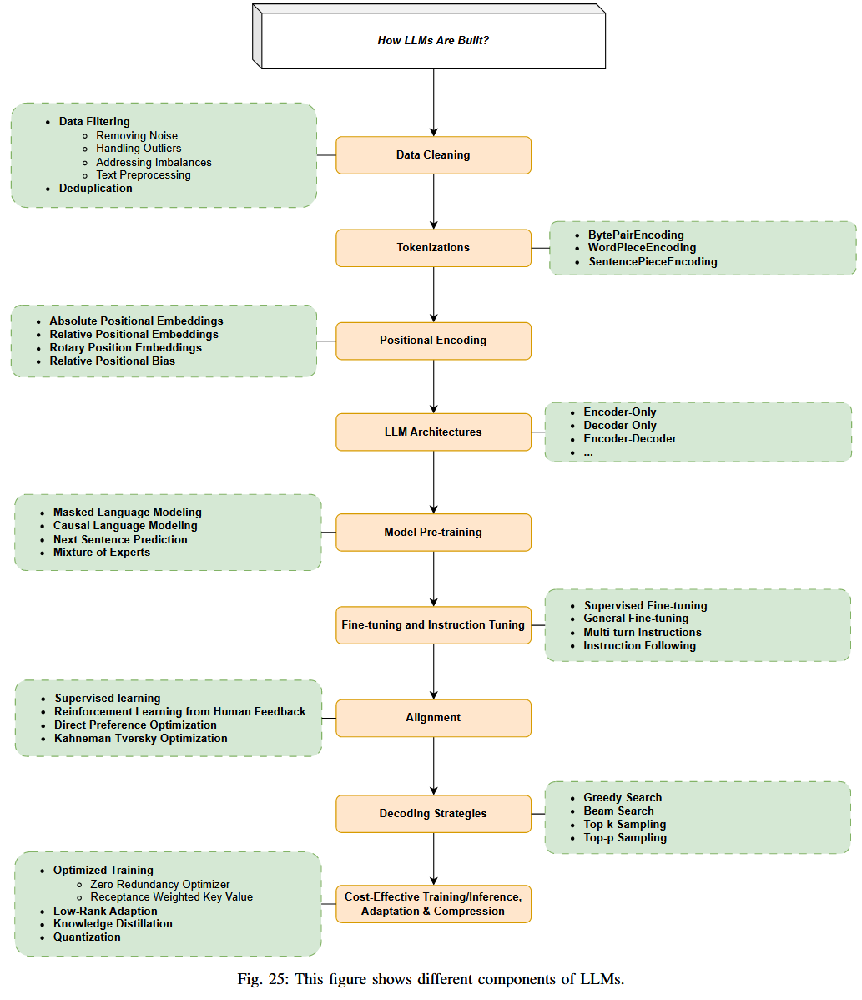

# How to build

## 1. Architecture 

### Transformer 

### Encoder Only 

### Decoder Only 

### Encoder Decoder 

## 2. Data Cleaning 

### Data Filtering

### Deduplication 

## 3. Tokenizations 

## 4. Positional Encoding 

## 5. Model Pre-training 

## 6. Fine-tuning and Instruction Tuning 

## 7. Alignment 

## 8. Decoding Strategies 

## 9. Cost-Effective Training/Inference/Adaptation/Compression

